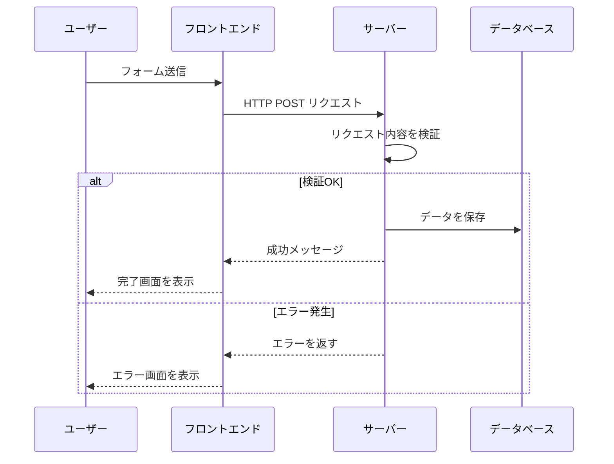

## Instructions

### このスキルが目指すもの

**いいドキュメント = 読み手が効率よく目的を達成できるドキュメント**（実用性・ユーザビリティ。ISO 9241-11）。
「きれいに書けたか」ではなく「読み手が目的を果たせたか」で良し悪しが決まる。これを全工程の判断基準にする。

そのために満たすべき2軸:

| 軸 | 中身 |
|----|------|
| 正確に伝わる | 曖昧さを排除し、明確・具体的に、誤解なく読める文章で書く |
| 効率よく理解できる | **要点を先に伝える** / 話の流れを整える / 簡潔で読みやすい / **必要な情報だけを書く** |

---

### 前提：読み手はこう読む（だから構造で書く）

書く前に、読み手がどう読むかを押さえる。**読み手はドキュメントの2割ほどしか読まない。** だから闇雲に情報を増やすと、読みづらくなり、必要な情報が埋もれ、結局読まれなくなる。読み手は全部を読むのではなく、**構造をたどって必要な箇所に当たりをつけ、要点だけ掴む**。書き手はこの読まれ方に合わせて構造を作る。

#### 読み手が手がかりにする5つの階層要素

ドキュメントの階層構造は次の5要素で形作られる。読み手はこれをたどって「自分の欲しい情報がどこにあるか」を判断し、要点を掴む。**書く側は、各要素が単独で読まれても意味が通るように書く**（読み手はそこだけ読むため）。

| 要素 | 役割 | 何を書くか |
|------|------|-----------|
| タイトル | ドキュメント全体のテーマを示す | 何が書かれているか／何が言いたいか（例:『イシューからはじめよ』） |
| 見出し | サブテーマを示す | 同上を章単位で（例:「機能の概要」「操作手順」「トラブルシューティング」） |
| リード文 | タイトル・見出しの直後で本文へ導く | 本文に何が書かれ／何が言いたいかを先出しし、読み手を本文に導く |
| パラグラフ | 1つの話題 | 「言いたいこと」＋「その理由・説明」。話題とパラグラフは1対1 |
| 中心文 | パラグラフの言いたいこと（トピックセンテンス） | その段落で最も言いたい1文。これを支えるのが**支持文**（理由・説明） |

#### 辞書形式 vs 読み物形式（先に見極める）

書き始める前に、作るドキュメントがどちらかを見極める。形式によって構成の組み方が変わる。

| 形式 | 読まれ方 | 該当例 | 設計の勘所 |
|------|---------|--------|-----------|
| 辞書形式 | 特定の情報を**調べる**ために部分的に読む。目的が明確 | マニュアル・仕様書など説明型 | 検索性。見出し・索引・リンクで目的の箇所へ最短到達させる |
| 読み物形式 | 流れに沿って**最初から順に**読む。目的が曖昧になりがち | 報告型・説得型 | 話の流れ。要点を先に出し、最後まで読ませる導線を作る |

**多くのドキュメントは混合型**。純粋にどちらかであることは稀で、読み物の中に参照用テーブルがあったり、マニュアルに導入の読み物章があったりする。二択で固まらず、こう判断する:

- **ドキュメント全体は「主たる読まれ方」で構成を決める**。通読されるなら読み物形式（流れ・要点先行）、調べ物に使われるなら辞書形式（検索性）を骨格にする。
- **章・節は局所的に別モードでよい**。読み物形式の全体でも、コマンド一覧・設定値・用語集などは辞書的に（表・リスト・見出しで引ける形に）作る。逆も同様。
- 迷ったら**「読み手はこれを通読するか、必要な箇所だけ引くか」**で主モードを決める。通読層と引き層が**両方いる**なら、主要読者（Step 1 で絞った1人）で決める。つかなければ**読み物を骨格にし、引きは局所の辞書的な章で吸収する**（読み物の中に辞書的な章は足せるが、辞書骨格にあとから読み物を足すのは全体構成に響くため）。

---

### 全体フロー（必ずこの順序で進める）

```
Step 1: 読み手とテーマの選定   → 誰に何を伝えるか（目的）を絞り込む
Step 2: テーマの分解          → Why / What / How に分け、関連を整理する
Step 3: ドキュメントの構成     → 見出しの階層（アウトライン）を組み、見出しを決める
Step 4: 文章の構成            → 「言いたいこと」を並べ、つながりよく並び替える
Step 5: 文を書く             → 各「言いたいこと」に理由・説明・具体例を足す
Step 6: レビューと自動修正     → 成果物を独立した目で評価し、見つけた問題を自動で直す（収束まで）
```

**作成して終わりにしない。** Step 1〜5 で書いたら、必ず Step 6 のレビューハーネスにかけ、問題が収束するまで「評価 → 修正 → 再評価」を回す。作成からレビュー修正までを一貫したひと続きの工程として扱う。

**大きいものから小さいものへ、上流から下流へ。** いきなり文を書き始めない。構成が決まるほど「何を書けばいいか」が細かい単位で具体化され、文が書きやすくなる。上流を飛ばすと、書き直しが増え、話が散らかる。

各ステップの成果物を**ユーザーに見せて合意を取りながら**進める（特に Step 1〜3）。下流で気づいた手戻りより、上流での合意のほうが安い。

> **非対話環境（headless / subagent 実行など、ユーザーに即時に問えない場合）**: 合意を取れないステップで**止まらない**。各成果物を1〜2文で言語化して報告に残し、置いた仮定を明示したうえで先へ進む。最後の Step 6（レビューと自動修正）を合意の代替とする。AskUser を求める箇所の具体的な代替手順は Step 1 を参照。

---

### Step 1: 読み手とテーマの選定

**目的＝誰に何を伝えるか**を定める。ここが曖昧だと、ドキュメントは大きく複雑になり、結局誰の役にも立たない。

例:「プロダクトを初めて使うユーザーに、基本機能を説明する」「プロジェクトメンバーに、企画の意図を伝える」。

#### 読み手を絞り込む3つの観点

読み手とテーマが広すぎると像がぼやける。特に不特定多数を想定するときは、次の3点でターゲットを1人に絞り込む。

| 観点 | 問い | 書き分けへの影響 |
|------|------|------------------|
| 目的 | 読み手はこれを読んで何をしたいのか | 含める情報・ゴールが決まる |
| 知識レベル | 前提知識はどこまであるか | 用語の説明量・抽象度が決まる |
| 立場 | どんな役割・状況で読むか | トーン・優先順位・具体例の選び方が決まる |

#### 絞り込みが「詰め込みすぎ」を防ぐ

読み手とテーマを絞り込むほど、構成はシンプルになり、読み手に合った粒度で説明できる。逆に絞らないと情報を盛り込みすぎ、2割しか読まれない（前提節参照）ドキュメントの中で必要な情報が埋もれる。**情報は足し算ではなく引き算で設計する。**

特に**知識レベルの絞り込み**は、専門用語をどこまで使うか・用語解説を入れるか・どんな例えを使うかを決める。書き手の持っている知識をそのまま出力するのではなく、**読み手の理解度に合わせて翻訳する**。

> 失敗例: AI は自分が持つ知識をそのまま出力して読ませようとしがち。だがプロンプトを書いた人は詳細実装を知らないことが多い。これは読み手の理解度を踏まえていないことが原因。常に「この読み手はこの用語を知っているか」を問う。

#### AskUser で目的を確定する（情報が足りなければ必須）

依頼文だけで上の3観点が埋まらないなら、書き始める前に **AskUser で1回にまとめて聞く**（最大4問）。

- 読み手は誰か（役割・知識レベル）
- 読み手の主な目的は何か（読んだ後に何ができればいいか）
- 扱うテーマの範囲はどこまでか（含める／含めない）
- ドキュメントの形式・分量の希望

**絞り込みの判断**: 1ドキュメント＝1読み手・1目的が基本。読み手や目的が複数あるなら、分割するか、対象を明記して章を分ける。「全員向け」は「誰向けでもない」になりがち。

#### AskUser が使えない場合（headless / subagent 実行）

非対話環境では AskUser を呼べない。だが**ここで止まらない**。次の順で進める:

1. 3観点（目的・知識レベル・立場）を、依頼文・文脈・既存資料（リポジトリの性質、周辺ドキュメント等）から読み取れる範囲で**自分で仮定として確定する**。
2. 置いた仮定（誰に・何を・何のために）を**ドキュメント冒頭または報告に必ず明記する**。読み手が前提を検証でき、誤りなら後から正せる。
3. 根拠の乏しい重要な仮定には「要確認」と印を添える。

**止まって何も書かないより、明示した仮定の上で書き切るほうが価値が高い。** 仮定が外れても、前提が書いてあれば修正は容易。

**この段階の成果物**: 「誰に・何を・何のために」を1〜2文で言語化する。対話可能ならユーザーに確認し、非対話環境なら成果物の冒頭または報告に明記する。

---

### Step 2: テーマの分解

テーマを **Why / What / How** の3要素に分解する。これが Step 3 の見出しの骨格になる。

**なぜ分解するか**: 分解すると ①論理的な構成になり ②複雑な情報が整理され ③読み手が情報を探しやすくなる。逆に分解できていないと、**書き手が伝えたいこと（してほしい操作・自分の意見）だけ**を書いたドキュメントになる。例: マニュアルに操作方法（How）だけ書いても、それが何の機能で・使うと何を得られるか（What・Why）が抜けていては、読み手はそもそも使う理由が分からない。

| 要素 | 中身 |
|------|------|
| Why | なぜ必要か / 何のためか / どんな問題を解決するか |
| What | 何であるか / 何ができるか / 対象は何か |
| How | どうやるか / 手順 / 使い方 |

#### 文書タイプ別の Why / What / How

3要素の中身は文書タイプで変わる。Step 1 で見極めた形式・目的に合わせて埋める:

| 文書タイプ | 例 | なぜ(Why) | 何を(What) | どうやって(How) |
|-----------|-----|-----------|-----------|----------------|
| 説明型 | プロダクトのマニュアル | プロダクトの利用目的 | どんなプロダクトか・できること | プロダクトの使い方 |
| 説得型 | プロジェクトの企画書 | プロジェクトの背景・目的 | プロジェクトのゴール | ゴールを実現する手段 |
| 報告型 | プロジェクトの報告書 | プロジェクトの背景・目的 | プロジェクトの成果 | 成果を得た手段 |

説明型は辞書形式、説得型・報告型は読み物形式になりやすい（Step 1 の形式判断と対応する）。

#### 大きなテーマは階層で分解する

テーマが大きいと、1階層の Why/What/How では情報を扱いきれない。**階層を増やし、各階層をそれぞれ Why/What/How に分ける**。分解の方法は2つある:

| 方法 | 何で割るか | 例（メッセージアプリ） |
|------|-----------|----------------------|
| 構成要素で分解 | 全体を構成するパーツ | 会話機能 / 連絡帳機能 / プロフィール機能。さらに会話→チャット・通話・ビデオ通話 |
| 具体例で分解 | 代表的なユースケース・種類 | 「家族や友人と話す」「仕事の連絡をする」などの使い方で割る |

> 猫で例えると、**構成要素**＝頭・耳・胴体・足・しっぽ、**具体例**＝ペルシャ・マンチカン・スコティッシュフォールド。どちらも「猫」という複雑な概念を分けて捉える方法。

いずれも **全体から部分へ・概要から具体へ** 順序立てて説明する。読み手は対象の構造を頭に思い描きながら、複雑なものを順に理解できる。

分解例（構成要素で分解した場合）:

- **1階層目「メッセージアプリ」**: なぜ=アプリの利用目的 / 何を=アプリ・会話・連絡帳・プロフィール各機能の概要 / どうやって=基本的な使い方
- **2階層目「会話」**: なぜ=会話機能の利用目的 / 何を=チャット・通話・ビデオ通話の概要 / どうやって=各機能の使い方

**どちらの分解を選ぶか＝読み手の目的に合わせる**。機能を網羅的に把握したい読み手なら構成要素で、特定の目的を達成したい読み手ならユースケース（具体例）で分解する。Step 1 で絞った読み手の目的が、分解軸の取捨選択を決める。

**読み手によって要素の重みも変わる**。初学者は Why から、経験者は How だけ欲しいことが多い。Step 1 で絞った読み手に合わせ、どの要素を厚くするか決める。

仕様書・マニュアル・業務マニュアルなど、1つで多くの情報を扱うドキュメントでは、情報量が多くなる。読み手が**必要な情報を探しやすくする工夫**を、次の Step 3 の構成と合わせて設計する:

- 関連項目を **WikiLink (`[[...]]`)** で繋ぐ
- 冒頭に目次・索引（MOC的な入口）を置く
- 「この章は誰が読むべきか」を章頭に書く

---

### Step 3: ドキュメントの構成を組む（アウトライン）

Step 2 で分解した要素を、見出しの階層構成＝**アウトライン**に組む。アウトラインは章・節・項などの見出しを階層的に並べたもの。本文を書く前に、ここで論理と配置を固める。

#### アウトライン と 目次 は役割が違う

同じ見出しの集まりでも、向く相手が違う:

| | 誰のため | 役割 |
|---|---|---|
| アウトライン | 書き手 | ①論理を組み立てる ②どこに何を書くかを決める |
| 目次 | 読み手 | ①必要な情報を探す手がかり ②要点を掴む手がかり |

**良いアウトラインは、そのまま読み手の良い目次になる。** 書き手の道具が読み手の道具を兼ねるように組む。

#### アウトラインの組み方（4ステップ）

**1. 要素を並び替える** — Step 2 で分解した要素を、読み手に伝える順番に並べる。並べ方のパターン:

| パターン | 使いどころ |
|---|---|
| 既知 → 未知 | 読み手が知っていることから入る |
| 時系列 | 手順・経緯をたどる |
| 重要度の高い順 | 要点を先に（説得型・報告型） |
| ニーズの大きい順 | 読み手がよく探す情報を上に置く |
| Why → What → How | 説明型の基本順 |

**2. 見出しをつける要素を選ぶ** — 全要素に見出しは要らない。内容の**重要度と量**で決める:

- 内容が多い／重要な要素 → 見出しをつける
- 内容が少ない要素 → パラグラフに収める、または近い要素と統合して1見出しにまとめる

**3. 見出しを決める** — 「本文に**何が書かれているか**」または「本文で**何が言いたいか**」を、**できるだけ具体的に**表す。言いたいことまで言える見出しのほうが、読み手は速く掴める:

| 弱い見出し | 強い見出し | なぜ |
|---|---|---|
| 「公開チャットとは」 | 「公開チャットはこんな時に使える」 | 言いたいこと（使いどころ）まで表す |
| 「背景」 | 「なぜ手動運用をやめたか」 | 何が言いたいか分かる |
| 「詳細」「その他」 | （中身が読み取れないので不可） | 情報ゼロの見出し |

結論、**読み手の目的に沿った見出し**にする。

**4. 見出しだけを流し読みする** — 最後に見出しだけを上から読み、(a) どこに何があるか (b) ドキュメントの言いたいことのあらまし、をざっくり掴めるか確認する。掴めなければ見出しを直す。**あらましを掴む情報は、本文ではなく見出しに現れていなければならない**（例:「公開チャットはこんな時に使える」の"こんな時"の答えが、その下の見出しだけで分かるか）。

#### 階層構造に沿って組む

テーマが大きいときは、Step 2 で分解した階層（構成要素 or 具体例）に沿って見出しレベルを割り当て、全体 → 部分の順に並べる:

```
# テーマ
## サブテーマ（Why / What / How など）
### 話題（パラグラフ単位）
```

#### リード文で本文へ導く

長い章・重要な章では、見出しの直後に**リード文**を置く。リード文は「本文に何が書かれているか／何が言いたいか」を先出しし、見出しだけでは足りない情報を補って読み手を本文へ導く。読み手はリード文で本文の中身に当たりをつけ、読むか飛ばすかを判断できる（＝2割しか読まない読み手への導線）。短い章では不要。冗長になるなら省く。

**この段階の成果物**: 見出しのアウトライン（階層付き）。対話可能ならユーザーに見せて合意を取り、本文を書く前に方向性を固める（非対話環境なら全体フローの縮退方針に従う）。

---

### Step 4: 文章の構成を組む

各見出しの中身（文章）は、**「1つの言いたいこと」＋「その理由や説明」**の組み合わせでできている。この2つを組み合わせ、話題ごとに読み手の納得を得ながら進める。

文章の構成は次の手順で組む:

1. **言いたいことだけを書き並べる**（理由や説明はまだ書かない。1行＝1主張の箇条書き）
2. **言いたいこと同士のつながりが良くなるよう並び替える**（前提→結論、原因→結果、概要→詳細 など）
3. 並べ終わったものが、その見出しの「文章の構成」になる

```
（例：「なぜ手動運用をやめたか」の言いたいこと一覧）
- 手動運用はミスが多かった
- 月末に作業が集中し負荷が高かった
- バッチ化で件数に依存せず一定時間で終わる
↓ つながりで並び替え（問題→問題→解決）
そのまま Step 5 で各行に理由・説明を足す
```

**要点を先に**: 並び替えの基本は結論・要点を先頭に置くこと。読み手は冒頭で全体像をつかめ、効率よく理解できる。

---

### Step 5: 文を書く

並べた「言いたいこと」1つ1つに、**理由・説明・具体例**を書き足していく。1つの言いたいこと＋その肉付け＝1パラグラフが基本。

パラグラフ内の役割分担を意識する:言いたいことを述べる1文が**中心文（トピックセンテンス）**、それを支える理由・説明が**支持文**。読み手は中心文を拾って要点を掴むので、**各パラグラフの先頭に中心文を置く**（要点を先に）。1パラグラフに中心文は1つ。言いたいことが2つあるなら段落を分ける。

肉付け（支持文）の主な型は3つ:

| 型 | 言い回し | 使いどころ |
|----|---------|-----------|
| 理由を述べる | 「なぜなら〜だからです」 | 主張の根拠を示す |
| 説明を述べる | 「つまり、〜ということです」 | 言い換え・敷衍して明確にする |
| 具体例を挙げる | 「例えば〜があります」 | 抽象的な主張を具体に落とす |

#### わかりやすい文に整える

各文は ①必要な情報を正しく得られる ②効率よく理解できる ③余計な負担なく受け止められる、を満たす。**明確で正確な言葉を優先し、冗長な表現・修飾語を削る**のが土台。工夫を2方向で挙げる。

**A. 効率よく理解できる（素早く要点を取れる）**

| 工夫 | やり方 | 改善前 → 改善後 |
|------|--------|----------------|
| 重要なことから書く | 結論・要点を先頭に（一部しか読まれない前提で優先度をつける） | 理由を並べてから結論 →「業務でのスマホ活用は生産性向上につながる」を先頭に |
| 読み手の視点で書く | 仕組みの説明でなく、読み手が**得るもの・すべき操作**で書く | 「定期的にチェックし自動更新します」→「有効にすると常に最新版を使えます」 |
| 能動態と受動態を使い分ける | 主語に立てたいもの（動作主か対象か）で選ぶ | 「自動的にアプリをアップデートします」→「アプリが自動的にアップデートされます」 |
| 簡潔に・一文一義 | 1文に含める情報を減らす。長い説明は複数文に、手順は番号リストに分ける | 「設定を選択し Wi-Fi を選択したのちオンにします」→ 1.設定 2.Wi-Fi 3.オン |
| 並列を見える化 | 「や」「と」の連発をやめ、読点・中点で区切る | 「AやBやC」→「A・B・C」 |

**B. 正しく理解できる（誤解させない）**

| 工夫 | やり方 | 改善前 → 改善後 |
|------|--------|----------------|
| 具体的に書く | 抽象語・曖昧語（「適宜」「なるべく」「早めに」「等」）を数値・条件・状態に | 「早めに終わる見込み」→「通常10分ほどで完了します」／「音量設定を確認」→「消音になっていないか確認」 |
| 係り受けを明確に | 読点・語順で修飾の係りを一意に。指示語の指す先も一意に | 「簡単なチャットアプリの作り方」→「チャットアプリの簡単な作り方」 |
| 肯定形で書く | 「〜しないで」を「〜してください」に言い換える | 「放置しないでください」→「早めに適用してください」 |

**箇条書きは重要な情報だけに使う**。視覚的に目立つので、軽い並列にまで使うと「重要そう」に見えて逆効果。**目安**: 3項目以上で各項目が独立した操作・手順・選択肢なら箇条書き、語句の羅列（軽い並列）なら読点・中点で十分。例:「参加者管理・メッセージ削除・ルーム削除ができる」は中点、一つずつ実行させたい手順なら箇条書き。

**読点は多機能**。並列・係り受けのほか、理由／条件／目的の切れ目、節の区切り、接続の強調にも効く。読みにくい1文は、まず読点の位置と数を疑う。

> **否定形の使い分け**: 回りくどい禁止・指示の否定（「放置しないでください」）は肯定形（「早めに適用してください」）に直す。一方、利得や事実を表す自然な否定（「他の案件と混ざらない」「手間が減る」）はそのまま使ってよい。「してほしくないこと」を**強調**したいときは、あえて否定形にする。

#### 図表で表す（文章より速いとき）

人間は文字を読むより、図で直感的に示されたほうが理解が速い。**文章で追うのが面倒な関係・流れは、図表にする。** ただし**作りすぎない**——単純な事実や短い列挙まで図にすると、かえって読みにくい。

**図にする目安**: 複数の登場人物（アクター）の間を情報が行き来するフロー。例「ユーザーがフォームを送信し、データが DB に保存されるまで」くらいの粒度なら図にする。**シーケンス図を推奨**。

この例を図にすると、文章より関係が一目で掴める:



中身に合った図表を選ぶ: 複数アクターのやりとりは**シーケンス図**、並列の対比は**表**、状態の移り変わりは**状態遷移図**、手順は**番号リスト**。

---

### 全工程を貫く原則

| 原則 | 意味 | 効く工程 |
|------|------|---------|
| 要点を先に伝える | 結論・全体像を冒頭に。読み手が早く理解できる | Step 4・5、各見出しの冒頭 |
| 話の流れを整える | 前提→結論、概要→詳細など自然な順序にする | Step 3・4 |
| 簡潔で読みやすく | 一文を短く、冗長を削る | Step 5 |
| 必要な情報だけ書く | 読み手の目的に効かない情報は載せない | Step 1〜5 全部 |
| 曖昧さを排除 | 明確・具体的・誤解なく | Step 5 |
| 図表で表せるものは図表で | 文章より直感的で速い。ただし作りすぎない | Step 3・5 |

迷ったら原点に戻る:**「この読み手は、これで目的を効率よく達成できるか？」**

---

### Step 6: レビューと自動修正（[[doc-review-fix-loop]] に委譲）

書いた本人は、自分の曖昧さにも抜け漏れにも気づけない。だから作成で終わらせず、**独立した目で評価し → 問題を診断・分類し → 直せるものはその場で自動修正し → 内容を変えたら再評価する**、という閉ループを収束まで回す。**このループを回し切るまでがドキュメント作成**。

このレビューハーネスは独立スキル **[[doc-review-fix-loop]]**（および1パスの実体 [[doc-review-fix]]）に切り出してある。Step 1〜5 で書き上げたら、対象ファイルと Step 1 の読み手像（「誰に・何を・何のために」）を渡してこのループを起動する。

```
Step 1-5 で生成 ──▶ doc-review-fix-loop を起動
                      └ 各パス: ①レビュー（白箱＋読み手サブエージェント並列）
                               → ②診断・分類 → ③自動修正 → ④再レビュー
                      critical/major がゼロに収束、または上限到達まで繰り返す
```

委譲先で行われること（概要だけ把握しておけばよい。詳細は各スキル本文）:

- **2系統のレビューを並列サブエージェントで実行** — A. 白箱（このスキルの原則をルーブリックで採点）と B. 黒箱（Step 1 の読み手になりきった2〜3名が初見で Q1〜Q4 に回答）。観点が違うので両方かける。
- **問題を3分類して扱いを変える** — 自動修正（書き換えで直る）／情報補充（元資料にある不足を補う）／**捏造リスク（元資料に無い不足は創作せず「要確認」と明記）**。捏造しないことが「読み手全員 OK」に優先する。
- **収束まで回す** — 修正で内容を変えたら新しいサブエージェントで再レビュー。critical/major がゼロ（または残りが要確認のみ）で収束、最大イテレーションで打ち切り。何を見つけ・どう直し・何が残ったかをレポートに残す。

サブエージェントを dispatch できない環境（書き手自身がサブエージェントとして動いている等）でも、委譲先が白箱＋劣化版自己レビューに縮退して動く（その旨をレポートに明記する）。

> **このスキル単体で完結させる必要があるとき**（[[doc-review-fix-loop]] が配置されていない等）は、上の「委譲先で行われること」を Step 6 として自分で実行する。評価軸は一貫して「読み手が目的を効率よく達成できるか」（ISO 9241-11）。

---

### よくある失敗

| 失敗パターン | 対策 |
|---|---|
| 読み手を決めずに書き始める | Step 1 で「誰に・何を・何のために」を1文にしてから進む |
| 「全員向け」にして誰にも刺さらない | 読み手を1人に絞る。複数なら分割か章分け |
| 情報を詰め込みすぎる（2割しか読まれない前提を忘れる） | 読み手とテーマを絞り、引き算で設計する |
| 自分の知識をそのまま出力する | 読み手の知識レベルに合わせて用語・例えを翻訳する |
| 辞書形式なのに流れ重視で書く（逆も） | 形式を先に見極め、検索性／流れのどちらを優先するか決める |
| How（操作・手段）だけ書いて Why/What が抜ける | Step 2 で Why/What/How に分解。「何の機能で・何が得られるか」を必ず添える |
| 大きなテーマを1階層に詰め込む | 構成要素 or 具体例で階層分解し、全体→部分へ順序立てる |
| 構成を飛ばしていきなり文を書く | Step 3 のアウトライン合意を経てから本文を書く |
| 見出しが「詳細」「その他」 | 中身か主張が読み取れる名前にする |
| 見出しが「〜とは」止まりで主張がない | 「〜はこんな時に使える」など言いたいことまで具体化する |
| 見出しだけ読んでも全体のあらましが掴めない | Step 3 の流し読みチェック。あらまし情報を見出しに上げる |
| 全要素に機械的に見出しをつけて細切れになる | 重要度・量で取捨選択。少ない内容はパラグラフ化か統合 |
| 長い章で見出しから本文へ唐突に入る | リード文で本文の中身を先出しし、読み手を導く |
| パラグラフに言いたいことが複数 | 1パラグラフ＝1中心文。複数なら段落を分ける |
| 結論（中心文）が段落末にある | 中心文を各パラグラフ・各章の先頭へ |
| 「適宜」「なるべく」「等」が多い | 具体的な数値・条件・固有名に置換する |
| 一文が長く多義的 | 一文一義に分割。主語と述語を近づける |
| 仕組みを説明して読み手の得るものを書かない | 読み手が得るもの・すべき操作で書く（読み手視点） |
| 「や」「と」を連ねて並列が埋もれる | 読点・中点で区切る。重要な並列だけ箇条書き |
| 否定形で回りくどい | 肯定形に言い換える（禁止を強調したいときのみ否定形） |
| 複数アクターの流れを文章でだらだら書く | シーケンス図にする（ただし図を作りすぎない） |
| 「念のため」で情報を盛る | 読み手の目的に効かない情報は削る |
| 自分で読み返して OK とする | 書いた本人は客観視できない。新規サブエージェントに読ませる |
| 検証を「きれいさ」で評価する | 評価軸は「読み手が目的を達成できるか」（ISO 9241-11） |
| 書いたら完成にする（レビューを回さない） | Step 6 のレビューハーネスで critical/major が収束するまで回す |
| 白箱だけ／黒箱だけで済ます | A（ルール準拠）と B（読み手の実害）は観点が違う。両方かける |
| 修正後に再レビューしない | 内容を変えたら新しいサブエージェントで再評価（前の目は使い回さない） |
| 足りない情報を創作で埋めて Q2 を通す | 捏造リスクは「要確認」と明記して残す。捏造はしない |
| レビュー結果を黙って捨てる | 何を見つけ・どう直し・何が残ったかを報告に残す |
